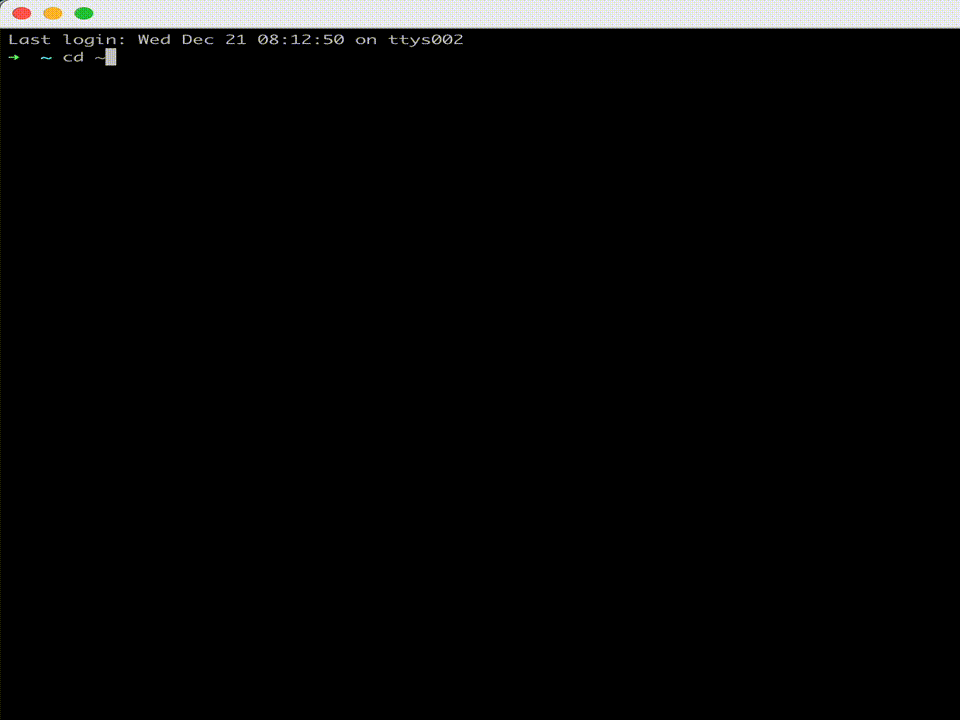

# Habits

Tracking habits at the command line using SQLite and bash.



## How to set it up

To set it up you need to modify the `config.ini` file and the run:

```sh
./habits.sh init
```

This will generate a SCHEMA.sql file and a bunch of scripts in `/lib`.

## How to use it

```sh
./habits.sh
```

### Arguments

I am using [argbash](https://argbash.readthedocs.io/en/stable/guide.html) to create command-line arguments for the file. Here are the possible arguments and modes (found by running `./run.sh --help`):

```
habits: A habit tracker for the CLI using Bash and SQLite
Usage: ./habits.sh [-d|--database <arg>] [-u|--update <arg>] [-s|--(no-)silent] [-h|--help] [--] [<mode>]
        <mode>: the mode (currently: run, test, export) (default: 'run')
        -d, --database: the database name (default: 'habits.db')
        -u, --update: specify the date to be updated (default: '')
        -s, --silent, --no-silent: silent mode (off by default)
        -h, --help: Prints help
```

For development purposes, to update the arguments you need to run `argbash src/arguments.m4 -o src/script.sh` and then copy the script.sh into `habits.sh`.

## Testing

We're going to use [shunit2](https://github.com/kward/shunit2) to test. Let's see how this goes...

```sh
./tests/runtests.sh
```

## Why?

I dunno, I like the simplicity of it and it gives me an opportunity to play with SQLite and Bash.

## License

Public Domain (or [Blue Oak Model License 1.0.0](https://blueoakcouncil.org/license/1.0.0) for those who need a license)